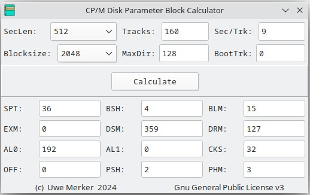

# CP/M Disk Parameter-Block Calculator

The Disk Parameter Block Calculator is a tool for calculating the entries of the Disk Parameter Block (DPB), which is required for writing a CP/M BIOS.

The calculated values can be transferred directly to the corresponding DPB.

If the calculation results in implausible values, the DPB result field is framed in red.